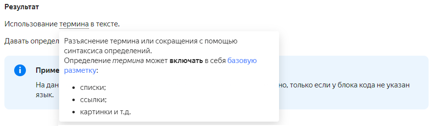

[*term]: Explaining a term or abbreviation using definition syntax.
The _term_ definition may *include* [basic markup](base.md):
* lists;
* links;
* images, etc.

# Definition

The syntax for definitions is:

```
[*term_key]: Explaining a term or abbreviation using definition syntax.
The term definition may include _basic_ markup.

Use of the [term](*term_key) in the text.
```

**Result**

Use of the [term](*term) in the text.

You can define terms anywhere on the page.



At the moment, the use of definitions in code blocks is possible only if the code block does not have a language specified.




