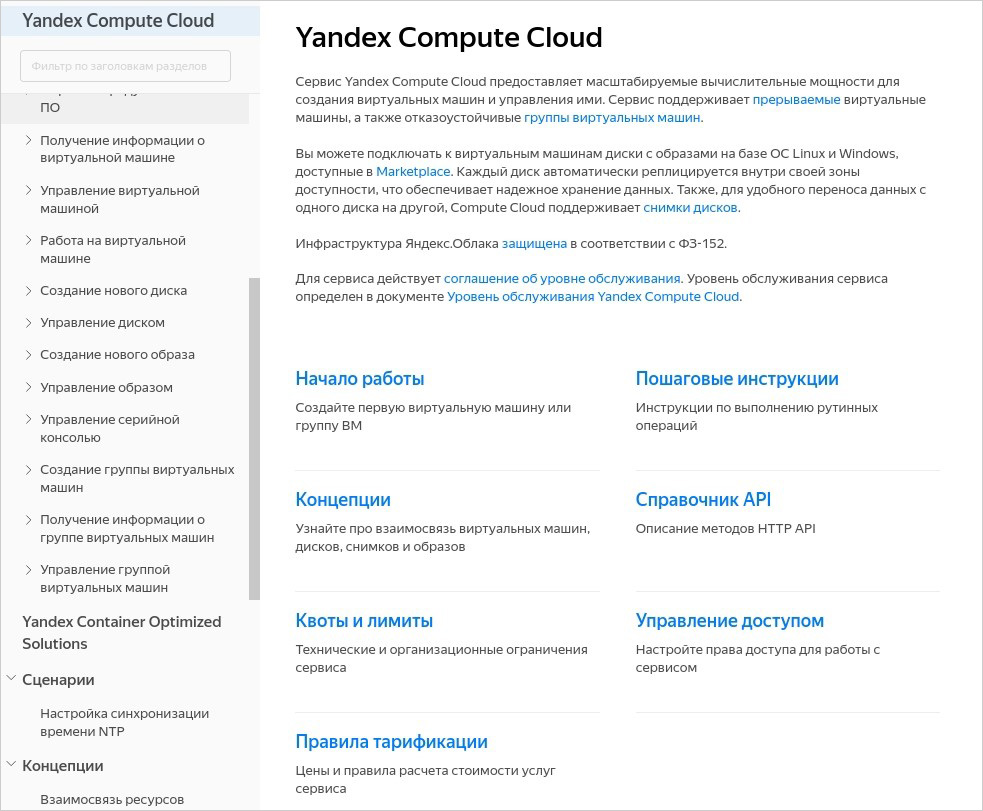

# Разводящая страница

Для быстрой навигации по документу вы можете оформить корневую страницу в виде сетки с ссылками на основные разделы.

**Пример**: оформление разводящей страницы [документации сервиса Yandex Compute Cloud](https://cloud.yandex.ru/docs/compute/).



## Структура {#structure}

Стандартная структура файла разводящей страницы `index.yaml` имеет вид:

```yaml
title: Имя документа
description: Описание документа
meta:
  title: Метаданные
  noIndex: true
links:
- title: Первый раздел
  description: Описание первого раздела
  href: path/to/file.md
- title: Второй раздел
  description: Описание второго раздела
  href: path/to/file.md
```
* `title` — название документа. Отображается в оглавлении над списком всех разделов.
* `description` — описание документа.
* `meta`— [метаданные](../syntax/meta.md#meta).
* `links` — группирующий элемент. Для каждого раздела внутри него задается:
    * `title` — название раздела. Отображается как имя ссылки.
    * `description`— описание раздела.
    * `href` — относительный путь до файла.

## Условия видимости элементов {#when}

Отдельные разделы можно отображать или не отображать на разводящей странице в зависимости от значений [переменных](../syntax/vars.md). Для описания условий видимости используется параметр `when`.

Доступные операторы сравнения: `==`, `!=`, `<`, `>`, `<=`, `>=`.

```yaml
- title: Раздел с условным вхождением
  description: Описание раздела
  href: path/to/conditional/file.md
  when: version == 12
```

## Постановки и условные операторы {#subtitudes}

Название и описание разделов и ссылок поддерживают [постановки](../syntax/vars#subtitudes) и [условные операторы](../syntax/vars#conditions).

```yaml
title: "{{ title }}"
description: "{{ description_legacy }}{{ description }}"
meta:
  title: "{{ meta_title }}"
links:
- title: "{{ link_title }}"
  description: "{{ link_description }}"
  href: path/to/conditional/file.md
```
