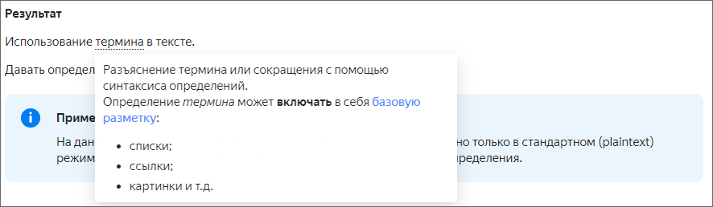

[*term]: Разъяснение термина или сокращения с помощью синтаксиса определений.
Определение _термина_ может **включать** в себя [базовую разметку](base.md):
* списки;
* ссылки;
* картинки и т.д.

# Определения

Синтаксис для определений имеет вид:

```
[*ключ_термина]: Разъяснение термина или сокращения с помощью синтаксиса определений.
Определение термина может включать в себя _базовую_ разметку. 

Использование [термина](*ключ_термина) в тексте.
```

**Результат**

Использование [термина](*term) в тексте.

Давать определения терминам можно в произвольном месте страницы.



На данный момент использование определений в блоках кода возможно, только если у блока кода не указан язык.




